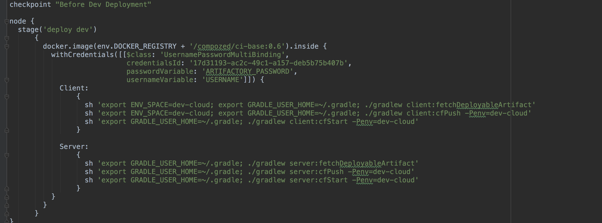

#HSLIDE
## Compozed Global Lunch and Learn
### Jenkinsfile

##### Banagalore, Belfast, Charlotte, Northbrook, Northland (NI), The Mart (Chicago), Tempe

#HSLIDE
### Jenkins
  * Jenkins Definition:
    * Automation server which can be used to automate tasks such as building, testing, and deploying software
  * Life before automating software deployment

#HSLIDE
### Jenkins
  * Benefits of Automated Software:
    * Deployments are less error-prone and more repeatable
    * Anyone on the team can deploy software
    * Devs spend time developing (instead of performing a time-consuming, thankless task)
    * More frequent releases

#HSLIDE
### Jenkinsfile
  * Life before a Jenkinsfile:

#HSLIDE
### Jenkinsfile
  * A text file that contains the definition/steps of a Jenkins Pipeline and is checked into source control

#HSLIDE
### Jenkinsfile
  * Add to the root of the project
  

#HSLIDE
### Jenkinsfile v. GUI - Legacy Pipeline

#HSLIDE
### Jenkinsfile v. GUI - Jenkinsfile Pipeline

#HSLIDE
### Benefits of using a Jenkinsfile
 1. Easier to move to a new Jenkins instance
    * Which we will all have to do at the end of Q2 (~June)
 2. Version Control    
 3. Easier to see logic hidden behind each job

#HSLIDE
### Benefits of using a Jenkinsfile
 4. Portability
    * Get up and running quickly when you move to a new team
 5. Supports more complexity (because it's groovy code)
    * Try/Catch blocks, functions, etc.

#HSLIDE
### Tips and Tricks
  1. Name your Jenkinsfile with the .groovy ending so your IDE highlights and assists you
  2. Let Gradle do the heavy lifting
    * Gradle has many plugins that allow tasks, such as adding your deployable artifact or pushing your app to Cloud Foundry, to be run simply by providing the config info to the plugin
    * Allows for a clean pipeline
  3. Use 'Pipeline Syntax' to help generate syntax for various tasks

#HSLIDE
### Let's get Started!!!
  1. Test and Publish Stage
  2. How to store credentials on Jenkins
  3. Deploy DEV
  4. Manual Input to Deploy Next Stage
  5. Deploy UAT
  6. Veracode
  7. Conveyor
  8. Saving Unit Tests
  8. Parallel Jobs
  9. Demo
<!-- ***************************** SWITCH TO DEMO MODE *************************** -->
<!-- The following slides give guidance as to what to talk through but are not for presenting -->

#HSLIDE
### Test and Publish Stage (Part 1: Setup)

  * (Line 1) Allocate an executor and workspace for the pipeline
    * Without node, the pipeline can't do any work!
  * (Line 2) Checkout the source code for this project
    * This is a quick easy way to access the correct version of the source code

#HSLIDE
### Test and Publish Stage (Part 1: Setup)

  * (Line 3) Create a Test stage
    * This name displays as a step on your pipeline
  * (Line 5) Set up a docker container
    * This tells it to run inside a specific docker image

#HSLIDE
### Test and Publish Stage (Part 1: Setup)

  * (Line 7-10) Set up your Credentials
    * credentialsId is pulled from the Jenkins credentials store and by default is a random GUID
    * can be specified to something more user friendly by adding variable

#HSLIDE
### Test and Publish Stage (Part 2: Run Tests)

  * (Line 11) Create a stage fragment (Optional)
    * Appears in output of logs, helps organize statements, and helps with setting up jobs to run in parallel

#HSLIDE
### Test and Publish Stage

  * (Line 14-17) Install your dependencies
    * Note: all actions occur at the root of the project where the Jenkinsfile is located (don't forget to change directory into your client)

#HSLIDE
### Test and Publish Stage

  * (Line 18) Build
  * (Line 19) Publish to Artifactory

#HSLIDE
### Test and Publish Stage

  * (Line 22-28) Run your server tests (using a custom gradle task) and then publish

#HSLIDE
### Test and Publish Stage

  * (Line 33) Add a checkpoint (Optional)
    * Goes outside the node closure
    * This tells Jenkins to save the current state so if it fails after this point it can be restarted at this checkpoint

#HSLIDE
<!-- ***************************** SHOW THESE SLIDES *************************** -->
### Storing Credentials on Jenkins

#HSLIDE
### Storing Credentials on Jenkins

  * For passwords in your .yml file, use Secret Text
  * For certs, use secret file

#HSLIDE
### Storing Credentials on Jenkins

#HSLIDE
### Storing Credentials on Jenkins

#HSLIDE
### Accessing Credentials in a Jenkinsfile with Syntax Generator

#HSLIDE
### Assigning Credentials to Environment Variables

#HSLIDE
### Accessing Credentials in a Jenkinsfile

  * In this example, you would access USERNAME in the Jenkinsfile by using env.MY_USERNAME

#HSLIDE
### Deploying to DEV

#HSLIDE
### Deploying to DEV
  * Similar setup to Test and Publish
  * Differences:
    * Cloudfoundry variables in credentials
    * Custom gradle task "fetchDeployableArtifact" is called
    * ENV_SPACE is defined to cloudfoundry environment
    * cfPush and cfStart
        * given to us by adding cloudfoundry dependency to build.gradle

#HSLIDE
### Manual Deployment to Higher Environments

  * This pauses your pipeline until manually triggered
  * Lots of configurations for this stage
    * Specify permissions for logged in user to trigger

#HSLIDE
### Deploying to UAT

#HSLIDE
### Adding a Veracode Stage
  * Veracode is a tool used for static code analysis.
    * Identifies potential security flaws and explains the risks and common fixes to said flaws
  * App teams are required to integrate Veracode scanning into their continuous integration pipelines  

#HSLIDE
### Conveyor
  * Uses blue green deployment
    * Runs two identical production environments called Blue and Green
    * At any time, only one of the environments is live, with the live environment serving all production traffic
  * Setup Conveyor by using a step in your build script and using the class ConveyorJenkinsPlugin  
  * From the script generator select step: General Build Step. Then select the Conveyor Plugin (version) under Build Step and the Conveyor form will appear.

#HSLIDE
###Saving Unit Test Results
  * Audit/compliance has required that we saved our unit test results and the commit sha
  * When conveyor raises the change with the artifact URL,
    * unit test results can be seen
    * new stories added since last release is visible
    * auditors can make sure stories have been accepted by product owner

#HSLIDE
### Parallel Jobs
  * Speeds up the build process

#HSLIDE
### For more info:
* This presentation will be posted out in Slack
* See also CompoZed Docs on [pipeline as code (Jenkinsfile)](https://docs.compozed.allstate.com/pages/deploying_apps/jenkins_ci/using-jenkins.html#pipeline-as-code)

### fin.
