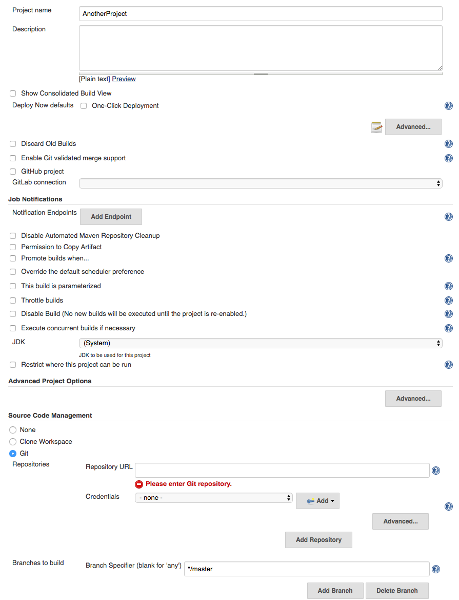
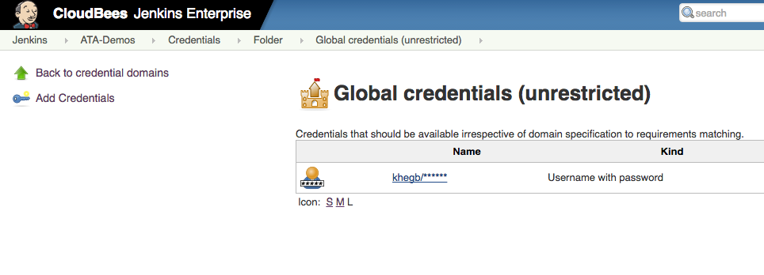
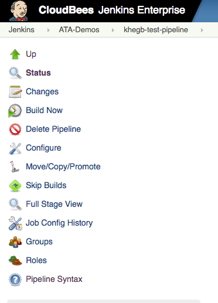
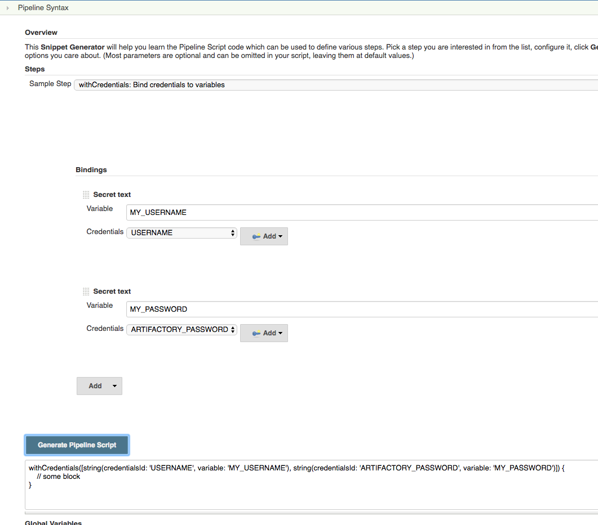

#HSLIDE
## Compozed Global Lunch and Learn
### Jenkinsfile

#HSLIDE
### Jenkins
  * Life before automating software deployment
  * Jenkins Definition:
    * Automation server which can be used to automate tasks such as building, testing, and deploying software
  * Benefits of Automated Software:
    * Deployments are less error-prone and more repeatable
    * Anyone on the team can deploy software
    * Devs spend time developing (instead of performing a time-consuming, thankless task)
    * More frequent releases 

#HSLIDE
### Jenkinsfile
  * Life before a Jenkinsfile:

#HSLIDE
### Jenkinsfile
  * A text file that contains the definition/steps of a Jenkins Pipeline and is checked into source control

#HSLIDE
### Jenkinsfile
  * Add to the root of the project

#HSLIDE
### Benefits of using a Jenkinsfile
 1. Easier to move to a new Jenkins instance
    * Which we will all have to do at the end of Q2 (~June)
 2. Version Control    
 3. Easier to see logic hidden behind each job
 4. Portability
    * Get up and running quickly when you move to a new team
 5. Supports more complexity (because it's groovy code)
    * Try/Catch blocks, functions, etc.

#HSLIDE
### Tips and Tricks
  1. Name your Jenkinsfile with the .groovy ending so IntelliJ highlights and assists you
  2. Let Gradle do the heavy lifting
    * Gradle has many plugins that allow tasks, such as adding your deployable artifact or pushing your app to Cloud Foundry, to be run simply by providing the config info to the plugin
    * Allows for a clean pipeline

  3. Use 'Pipeline Syntax' to help generate syntax for various tasks

#HSLIDE
### Let's get Started!!!
  1. Test stage
  2. Publish stage
  3. How to store credentials on Jenkins
  4. Deploy Dev
  5. Conveyor
  6. Manual Deploy to Production

#HSLIDE
### Test and Publish Stage (Part 1: Setup)

1. Allocate an executor and workspace for the pipeline
  * Without node, the pipeline can't do any work!
2. Checkout the source code for this project
  * This is a quick easy way to access the correct version of the source code
  
#HSLIDE
### Test and Publish Stage (Part 1: Setup)

3. Create a Test stage
  * This name displays as a step on your pipeline
5. Set up a docker container 
  * This tells it to run inside a specific docker image

#HSLIDE
### Test and Publish Stage (Part 1: Setup)

7-10. Set up your Credentials
  * credentialsId is pulled from the Jenkins credentials store and by default is a rand GUID
  * can be renamed to something more user friendly by adding variable
  * grab credentials off environment by using env.DONT_FORGET_TO_ADD_VARIABLE
ADD VARIABLE TO THIS REPO!!!    

#HSLIDE
### Test and Publish Stage (Part 2: Run Tests)

11. Create a stage fragment (Optional)
  * Appears in output of logs, helps organize statements, and helps with setting up jobs to run in parallel

#HSLIDE
### Test and Publish Stage

14-17. Install your dependencies
  * Note: all actions occur at the root of the project where the Jenkinsfile is located (don't forget to change directory into your client)

  

#HSLIDE
### Test and Publish Stage

18. Build
19. Publish to Artifactory

#HSLIDE
### Storing Credentials on Jenkins

#HSLIDE
### Storing Credentials on Jenkins

  * For passwords in your .yml file, use Secret Text
  * For certs, use secret file 

#HSLIDE
### Storing Credentials on Jenkins

#HSLIDE
### Storing Credentials on Jenkins

#HSLIDE
### Accessing Credentials in a Jenkinsfile

#HSLIDE
### Accessing Credentials in a Jenkinsfile

  * In this example, you would access USERNAME in the Jenkinsfile by using env.MY_USERNAME

#HSLIDE
### Deploying to Dev

#HSLIDE
### Conveyor
#### What is it, how does it work, and what are the benefits?

#HSLIDE
### Setting up a manual deployment to Production

#HSLIDE
### fin.
